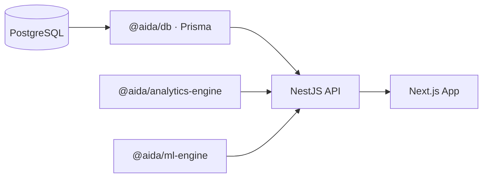

<p align="center">
  
  
  
  
  
  
  
</p>

# AIDA

CHC reporting data turned into something you can actually brief from: screening coverage, cohort gaps, district rollups, and a thin optional LLM layer that only ever narrates numbers the API already computed.

The UI never opens a database connection. Everything goes **Postgres → Prisma (`@aida/db`) → Nest API → Next.js**, with aggregations and derived metrics living in **`@aida/analytics-engine`** so the math stays in one place and the UI stays dumb.

---

## Why this exists (use case)

State and district CHC programs collect **monthly assessment rows per facility**: who was identified vs managed, what got screened against ANC registration, deliveries, neonatal signals, postnatal follow-up, and so on. The raw tables are hard to defend in a meeting if you cannot tie them to **rates**, **gaps** (identified minus managed on the same condition keys), and **time-bounded views** (filter by period, district, facility).

AIDA is built around that workflow:

| Idea | What the stack does |
|------|----------------------|
| **One row = one facility × reporting window** | `ChcAssessment` keyed by `facilityId` + `periodStart` / `periodEnd`. Filters on the API (`from` / `to` / `district` / `facilityId`) slice the same rows the dashboard uses. |
| **ANC screening as coverage** | Counts like `hiv_tested` are divided by summed `total_anc_registered` to produce screening rates (see `screeningRates` in the analytics engine). |
| **Identified vs managed** | Separate section tables; the API exposes `management_gap` and validation that managed counts do not exceed identified where the schema implies that constraint. |
| **Exploratory stats** | Pearson correlations and z-score anomalies on top of assessment-level series (`@aida/ml-engine`), clearly separated from the deterministic KPIs. |
| **Optional narrative** | `POST /v1/ai/insights` sends a JSON snapshot (same shape as overview) to an OpenAI-compatible endpoint; the model does not invent row counts. |

If that matches how your program thinks about accountability, the rest of this file is just wiring.

---

## Architecture



| Piece | What it owns |
|-------|----------------|
| `packages/db` | Prisma schema (field names are fixed; they match source forms), generated client |
| `packages/analytics-engine` | Sums, derived rates (mortality, LBW, preterm, institutional delivery mix), validation helpers |
| `packages/ml-engine` | Z-score anomaly flags, correlation matrix glue |
| `packages/ai-engine` | OpenAI-compatible client for optional insights |
| `packages/ui` | Shared layout and widgets (`PageShell`, KPI strips, etc.) |
| `apps/api` | Nest modules: analytics, metrics, facilities, ingestion, optional AI |
| `apps/web` | App Router, TanStack Query, Recharts, filter state in the URL |

---

## Run it

### Option A — Docker (least host clutter)

You only need **Docker Desktop** (Engine + Compose). Node and Postgres on the host are optional; images run the installs for you.

```bash
chmod +x run.sh
./run.sh
```

| Service | URL |
|---------|-----|
| Web | [http://localhost:3000](http://localhost:3000) |
| API health | [http://localhost:4000/v1/metrics/health](http://localhost:4000/v1/metrics/health) |

First image build can take a few minutes (`npm install` inside the Dockerfile). After that, layer cache usually wins. Tail logs with `docker compose logs -f`, tear down with `docker compose down`.

---

### Option B — Local Node + Postgres

| Requirement | Notes |
|-------------|--------|
| Node **20+** | [nodejs.org](https://nodejs.org) |
| Postgres **14+** | Or run only the DB from Compose: `docker compose up -d postgres` |
| **npm** | Ships with Node |

Then install from the repo root and follow the manual setup below.

---

## Setup (manual)

Run these from the **repository root**:

| Step | Command / action |
|------|------------------|
| 1. Install | `npm install` |
| 2. Env | Copy `.env.example` → `.env`. Set at least `DATABASE_URL` for Prisma. |
| 3. Client + schema | `npm run db:generate` then `npm run db:push` |
| 4. Seed | `npm run db:seed` (synthetic but logically consistent counts) |
| 5. Build | `npm run build` (packages then apps) |
| 6. API | `npm run dev:api` → default base `http://localhost:4000/v1` |
| 7. Web | `npm run dev:web` → `http://localhost:3000` |

Point the browser at the web app with `NEXT_PUBLIC_API_URL` if the API is not the default (e.g. `http://localhost:4000/v1`).

**Routes worth knowing:** `/` is the landing page. The app shell (nav, filters) lives under `/overview`, `/analytics`, `/explorer`, `/help`, etc.

---

## Public HTTPS (ngrok)

Handy when you want the UI on a phone without punching holes in your LAN. Install the [ngrok agent](https://ngrok.com/download), log in once with your authtoken.

The repo is set up so the Next app can proxy API traffic: browser uses `NEXT_PUBLIC_API_URL=/api/v1`, Next rewrites `/api/*` → `http://localhost:4000/*`. That means **one tunnel on port 3000** is enough.

1. Start API and web (`npm run dev:api` and `npm run dev:web`).
2. `ngrok http 3000`
3. Open the printed `https://….ngrok-free.app` URL.
4. Set `WEB_ORIGIN` in `.env` to that exact origin and restart the API so CORS matches.

If the tunnel URL is wrong or truncated, Safari will fail in opaque ways; the ngrok local inspector at `http://127.0.0.1:4040` shows the real forwarding URL.

---

## Optional LLM

The product is fully usable with **no** model server. To turn on narrative insights:

| Variable | Role |
|----------|------|
| `AI_INSIGHTS_ENABLED=true` | Gate on the server |
| `LM_STUDIO_BASE_URL` **or** `OPENAI_API_KEY` | OpenAI-compatible API; base URL is normalized to end with `/v1` where needed |

The UI can list models via `GET /v1/ai/models` and pass `model` in `POST /v1/ai/insights`. Counts in the narrative should always match the JSON payload, not the model’s imagination.

---

## API (selected)

| Method | Path | What you get |
|--------|------|----------------|
| `GET` | `/v1/analytics/overview` | KPIs, funnel, alerts, validation issue list |
| `GET` | `/v1/analytics/section/:section` | Per-field totals, optional % of ANC for the screening section, monthly series |
| `GET` | `/v1/analytics/correlations` | Anemia × BMI style correlations + matrix |
| `GET` | `/v1/analytics/district-rollup` | Aggregates by `facility.district` |
| `GET` | `/v1/analytics/clinical-cross-section` | Paired per-assessment points for scatters |
| `GET` | `/v1/analytics/anomalies` | Z-scores on delivery metrics (`live_births` or `maternal_deaths`) |
| `GET` | `/v1/analytics/explorer` | Assessment index with light previews |
| `GET` | `/v1/analytics/assessments/:id` | Full sections + remarks + documents + validation |
| `GET` | `/v1/facilities` | Facilities for dropdowns |
| `GET` | `/v1/facilities/districts` | Distinct districts |
| `GET` | `/v1/config` | Public flags (no secrets) |
| `GET` | `/v1/ai/models` | Model list when LM Studio is wired |
| `POST` | `/v1/ai/insights` | Narrative from JSON snapshot |
| `POST` | `/v1/ingestion/assessments` | Create assessment + sections (server-side validation) |
| `GET` | `/v1/metrics/health` | Liveness |
| `GET` | `/v1/metrics/counts` | Row counts + district list |
| `GET` | `/v1/ai/status` | Whether LLM path is available |

**Query params** on analytics `GET`s: `from`, `to`, `district`, `facilityId` (dates apply to `periodStart`). The web app mirrors them in the query string so a filtered view is shareable.

---

## Schema

Field names are **source-of-truth** in `packages/db/prisma/schema.prisma`. Do not rename columns in the app without a migration story.

- **Identified** and **managed** are different tables with parallel keys where the form requires it.
- **Remarks** (`observational_remarks`, `respondent_remarks`) and **documents** (`document_1` … `document_6`) are first-class; explorer and detail views surface presence / counts without dumping PHI into list endpoints by default.

Full column-level documentation lives in-app at **`/help`**.

---

## Performance

| Behavior | Detail |
|----------|--------|
| Overview cache | Responses for `GET …/analytics/overview` are cached per filter key for about **30 seconds** to cut repeated aggregation cost. |
| At very large row counts | Consider pushing heavy sums into SQL or materialized views; keep derived definitions in the analytics engine so the semantics stay centralized. |

---

<p align="center">
  <sub>Keep derived definitions in the analytics engine; keep the UI thin.</sub>
</p>
