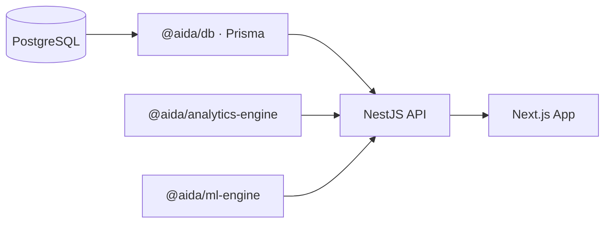

# AIDA — CHC Decision Intelligence Platform

Monorepo SaaS for **public health decision intelligence** (Community Health Centre assessment data). Data flows **DB → analytics engine → API → UI** — the web app never queries the database directly.

## What to install

### Option A — Full stack in Docker (recommended, one command)

| Install on your computer | Required? |
|--------------------------|-----------|
| **[Docker Desktop](https://www.docker.com/products/docker-desktop/)** (includes Docker Engine + Compose) | **Yes** |

**You do not need** Node.js, npm, pnpm, PostgreSQL, or any other runtime on your host for this path. The **frontend (Next.js)** and **backend (NestJS)** are built and run **inside Docker images**.

```bash
chmod +x run.sh
./run.sh
```

- **Web:** [http://localhost:3000](http://localhost:3000)  
- **API:** [http://localhost:4000/v1/metrics/health](http://localhost:4000/v1/metrics/health)  

The **first** `docker compose build` may take **several minutes** while `npm install` runs inside the images. Later builds use layer cache and are faster.

**Useful commands:** `docker compose logs -f` · `docker compose down`

---

### Option B — Develop on the host (no Docker for apps)

| Install | Required? |
|---------|-----------|
| **Node.js 20+** ([nodejs.org](https://nodejs.org)) | Yes |
| **PostgreSQL 14+** (or use `docker compose up -d postgres` only) | Yes |
| **npm** (comes with Node) | Yes |

Then use `npm install`, `npm run db:*`, `npm run dev:api`, `npm run dev:web` as in [Setup (manual)](#setup-manual) below.

---

## Architecture



| Package / app | Role |
|---------------|------|
| `packages/db` | Prisma schema (strict CHC field names), `PrismaClient` export |
| `packages/analytics-engine` | Aggregations, derived metrics, validation rules |
| `packages/ml-engine` | Anomaly detection (z-scores), correlation matrix |
| `packages/ai-engine` | Optional OpenAI-compatible LLM (LM Studio / OpenAI) |
| `packages/ui` | Design system primitives (`PageShell`, `KpiStrip`, …) |
| `apps/api` | NestJS: `ingestion`, `analytics`, `metrics`, `ml`, `ai` modules |
| `apps/web` | Next.js App Router, TanStack Query, Framer Motion, Recharts |

## Setup (manual)

1. **Install dependencies** (from repo root):

   ```bash
   npm install
   ```

2. **Environment** — copy `.env.example` to `.env` in the repo root (and/or set variables for each app). At minimum set `DATABASE_URL` for Prisma.

3. **Generate Prisma client & sync schema**:

   ```bash
   npm run db:generate
   npm run db:push
   ```

4. **Seed synthetic data** (logically consistent counts):

   ```bash
   npm run db:seed
   ```

5. **Build workspace packages** (analytics/ml/ai/db then API):

   ```bash
   npm run build
   ```

6. **Run API** (default `http://localhost:4000/v1`):

   ```bash
   npm run dev:api
   ```

7. **Run web** (default `http://localhost:3000`):

   ```bash
   npm run dev:web
   ```

Set `NEXT_PUBLIC_API_URL` (e.g. `http://localhost:4000/v1`) if the API is not on the default origin.

## Optional AI

The product works **without** any LLM. To enable narrative insights:

- `AI_INSIGHTS_ENABLED=true`
- `LM_STUDIO_BASE_URL` (OpenAI-compatible, e.g. `http://localhost:1234/v1`) **or** `OPENAI_API_KEY`

## API surface (selected)

| Method | Path | Purpose |
|--------|------|---------|
| GET | `/v1/analytics/overview` | KPIs, funnel, alerts, validation flags |
| GET | `/v1/analytics/section/:section` | Per-field metrics, distribution, time series |
| GET | `/v1/analytics/correlations` | Anemia × BMI correlations + matrix |
| GET | `/v1/analytics/anomalies` | Z-score anomalies on delivery metrics |
| GET | `/v1/analytics/explorer` | Assessment index (rich rows + meta) |
| GET | `/v1/analytics/assessments/:id` | Single assessment (all sections + validation) |
| GET | `/v1/facilities` | Facilities for filter dropdowns |
| GET | `/v1/facilities/districts` | Distinct districts |
| GET | `/v1/config` | Public API/runtime flags (no secrets) |
| POST | `/v1/ingestion/assessments` | Create assessment + all sections (logical validation) |
| GET | `/v1/metrics/health` | Liveness |
| GET | `/v1/metrics/counts` | Row counts + district list |
| GET | `/v1/ai/status` | LLM availability |

All analytics GET endpoints accept optional query params: `from`, `to`, `district`, `facilityId` (ISO date strings for from/to). The web app mirrors these in the URL so filters persist across navigation.

## Schema authority

All reporting field names match the Prisma models in `packages/db/prisma/schema.prisma`. **Identified** and **managed** cohorts are separate tables; **remarks** (`observational_remarks`, `respondent_remarks`) and **documents** (`document_1`–`document_6` as stored object keys/URLs) are first-class sections.

## Performance notes

- In-memory cache (60s TTL) on overview analytics.
- For 100k+ rows, add SQL aggregations / materialized views and keep the analytics engine as the single semantic layer for derived metrics.
