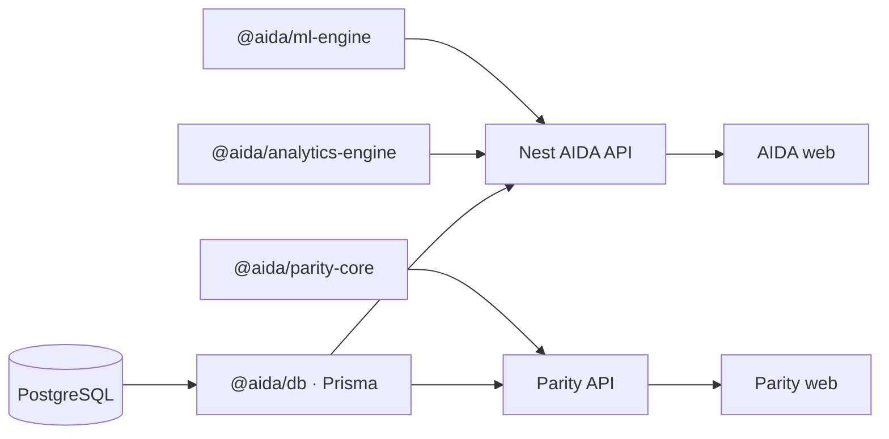

<p align="center">
  
  
  
  
  
  
  
</p>

# AIDA

Health facility reporting data turned into something you can actually brief from: screening coverage, cohort gaps, district rollups, and a thin optional LLM layer that only ever narrates numbers the API already computed.

The UI never opens a database connection. Everything goes **Postgres → Prisma (`@aida/db`) → Nest API → Next.js**, with aggregations and derived metrics living in **`@aida/analytics-engine`** so the math stays in one place and the UI stays dumb.

The same monorepo also ships **Parity** — a disciplined **ANC capture, analytics, and observation** workspace (`apps/parity-web`, `apps/parity-api`, `packages/parity-core`). AIDA and Parity share a visual language and a **product hub**: each app’s sidebar links to the hub on the other host when you configure cross-app URLs (see [Parity & product hub](#parity--product-hub)).

---

## Why this exists (use case)

State and district programs collect **monthly assessment rows per health facility**: who was identified vs managed, what got screened against ANC registration, deliveries, neonatal signals, postnatal follow-up, and so on. The raw tables are hard to defend in a meeting if you cannot tie them to **rates**, **gaps** (identified minus managed on the same condition keys), and **time-bounded views** (filter by period, district, facility).

AIDA is built around that workflow:

| Idea | What the stack does |
|------|----------------------|
| **One row = one facility × reporting window** | Facility assessment rows keyed by `facilityId` + `periodStart` / `periodEnd`. Filters on the API (`from` / `to` / `district` / `facilityId`) slice the same rows the dashboard uses. |
| **ANC screening as coverage** | Counts like `hiv_tested` are divided by summed `total_anc_registered` to produce screening rates (see `screeningRates` in the analytics engine). |
| **Identified vs managed** | Separate section tables; the API exposes `management_gap` and validation that managed counts do not exceed identified where the schema implies that constraint. |
| **Exploratory stats** | Pearson correlations and z-score anomalies on top of assessment-level series (`@aida/ml-engine`), clearly separated from the deterministic KPIs. |
| **Optional narrative** | `POST /v1/ai/insights` sends a JSON snapshot (same shape as overview) to an OpenAI-compatible endpoint; the model does not invent row counts. |

If that matches how your program thinks about accountability, the rest of this file is just wiring.

A consolidated **feature and capability list** (UI, API, packages) lives in [FEATURES.md](./FEATURES.md).

---

## Architecture



| Piece | What it owns |
|-------|----------------|
| `packages/db` | Prisma schema (AIDA + Parity models), generated client |
| `packages/analytics-engine` | Sums, derived rates (mortality, LBW, preterm, institutional delivery mix), validation helpers |
| `packages/ml-engine` | Z-score anomaly flags, correlation matrix glue |
| `packages/ai-engine` | OpenAI-compatible client for optional insights |
| `packages/ui` | Shared layout and widgets (`PageShell`, KPI strips, etc.) |
| `packages/parity-core` | ANC indicator schema, validation, analytics bundle for Parity |
| `apps/api` | Nest modules: analytics, metrics, facilities, ingestion, optional AI |
| `apps/web` | Full AIDA App Router UI (overview, analytics, explorer, correlations, optional AI, …) |
| `apps/parity-api` | Nest API for Parity taxonomy, submissions, observability (`/v1/parity/...`) |
| `apps/parity-web` | Parity workspace UI (hub, capture, analytics, observation centre) |

---

## Parity & product hub

**Product hub** is the entry surface that lets users choose **Parity** vs **full AIDA**. In development, Parity web is usually [http://localhost:3001](http://localhost:3001); AIDA web is [http://localhost:3000](http://localhost:3000).

| Navigation | Resolved with |
|-------------|----------------|
| AIDA sidebar → **Product hub** (Parity) | **`PARITY_WEB_URL`** (preferred). Server-side resolution reads repo-root `.env` at runtime so tunnel or demo hosts work after deploy without rebuilding. |
| Parity sidebar / hub → **Launch AIDA** | **`AIDA_WEB_URL`** (same pattern on the Parity app). |
| Optional `NEXT_PUBLIC_PARITY_WEB_URL` / `NEXT_PUBLIC_AIDA_WEB_URL` | Inlined at **`next build`** time. Fine for fixed URLs; for changing demo domains, rely on the non-`NEXT_PUBLIC_*` variables above. |

**CORS:** the AIDA API uses **`WEB_ORIGIN`** (browser origin for the AIDA web app). The Parity API uses **`PARITY_WEB_ORIGIN`** (see `apps/parity-api/.env.example`). Set each to the exact origin users type in the address bar (local, ngrok, or your public demo host).

**Reference:** Parity-only setup, HTTP routes, seeds, and Excel lineage — [docs/PARITY.md](./docs/PARITY.md).

**Smoke test:** after editing `.env`, `npm run verify:parity-aida-url` loads the root env and prints how Parity would resolve the AIDA base (extend or mirror checks as needed for your deploy).

---

## Run it

### Option A — Docker (least host clutter)

You only need **Docker Desktop** (Engine + Compose). Node and Postgres on the host are optional; images run the installs for you.

```bash
chmod +x run.sh
./run.sh
```

| Service | URL |
|---------|-----|
| AIDA web | [http://localhost:3000](http://localhost:3000) |
| AIDA API health | [http://localhost:4000/v1/metrics/health](http://localhost:4000/v1/metrics/health) |

Compose in this repo starts **Postgres + AIDA API + AIDA web** only. To run **Parity** as well, use local Node scripts (below) or **`./scripts/demo-start.sh`**, which brings up Postgres, both APIs, and both web apps.

First image build can take a few minutes. Dockerfiles are cache-friendly (`npm ci` + lockfile), so subsequent builds are much faster when dependency manifests do not change.

By default, API startup **does not seed**. If you need synthetic data:

```bash
./scripts/seed-data.sh
```

Tail logs with `docker compose logs -f`, tear down with `docker compose down`.

---

### Option B — Local Node + Postgres

| Requirement | Notes |
|-------------|--------|
| Node **20+** | [nodejs.org](https://nodejs.org) |
| Postgres **14+** | Or run only the DB from Compose: `docker compose up -d postgres` |
| **npm** | Ships with Node |

Then install from the repo root and follow the manual setup below.

---

## Setup (manual)

Run these from the **repository root**:

| Step | Command / action |
|------|------------------|
| 1. Install | `npm install` |
| 2. Env | Copy `.env.example` → `.env`. Set at least `DATABASE_URL`. For cross-app links and demos, set **`PARITY_WEB_URL`**, **`AIDA_WEB_URL`**, and **`WEB_ORIGIN`** as described in [Parity & product hub](#parity--product-hub) (`.env.example` is grouped by section). |
| 3. Client + schema | `npm run db:generate` then `npm run db:push` |
| 4. Seed | `npm run db:seed` (synthetic but logically consistent counts, optional if DB already has data) |
| 5. Build | `npm run build` (packages then AIDA + Parity apps) |
| 6. API | `npm run dev:api` → default base `http://localhost:4000/v1` |
| 7. Web | `npm run dev:web` → `http://localhost:3000` |

**Parity (optional, same DB):**

| Step | Command / action |
|------|------------------|
| API | `cp apps/parity-api/.env.example apps/parity-api/.env` → set `DATABASE_URL` (and `PARITY_WEB_ORIGIN` if not using default `http://localhost:3001`) → `npm run dev:parity-api` → [http://localhost:4010](http://localhost:4010) |
| Web | `cp apps/parity-web/.env.example apps/parity-web/.env.local` → `npm run dev:parity-web` → [http://localhost:3001](http://localhost:3001) |

**Full local demo stack (one script):** `./scripts/demo-start.sh` starts Postgres (Docker), AIDA API/Web, and Parity API/Web; optional `--tunnel` runs **cloudflared** when `DEMO_TUNNEL_UUID` (or `CLOUDFLARED_TUNNEL_ID`) is set.

Point the browser at the web app with `NEXT_PUBLIC_API_URL` if the API is not the default (e.g. `http://localhost:4000/v1`).

**Routes worth knowing:** `/` is the landing page. The app shell (nav, filters) lives under `/overview`, `/analytics`, `/explorer`, `/help`, etc.

---

## Public HTTPS (ngrok)

Handy when you want the UI on a phone without punching holes in your LAN. Install the [ngrok agent](https://ngrok.com/download), log in once with your authtoken.

The repo is set up so the Next app can proxy API traffic: browser uses `NEXT_PUBLIC_API_URL=/api/v1`, Next rewrites `/api/*` → `http://localhost:4000/*`. That means **one tunnel on port 3000** is enough.

1. Start API and web (`npm run dev:api` and `npm run dev:web`).
2. `ngrok http 3000`
3. Open the printed `https://….ngrok-free.app` URL.
4. Set **`WEB_ORIGIN`** in repo-root `.env` to that exact HTTPS origin and restart the **AIDA** API. If you expose **Parity** on a separate tunnel or host, set **`PARITY_WEB_ORIGIN`** in `apps/parity-api/.env` to the Parity web origin and restart **Parity** API.

5. Set **`AIDA_WEB_URL`** and **`PARITY_WEB_URL`** in repo-root `.env` to the public bases (no trailing slash) so sidebar and hub links target the tunnel or demo hosts without a rebuild.

If the tunnel URL is wrong or truncated, Safari will fail in opaque ways; the ngrok local inspector at `http://127.0.0.1:4040` shows the real forwarding URL.

---

## Optional LLM

The product is fully usable with **no** model server. To turn on narrative insights:

| Variable | Role |
|----------|------|
| `AI_INSIGHTS_ENABLED=true` | Gate on the server |
| `LM_STUDIO_BASE_URL` **or** `OPENAI_API_KEY` | OpenAI-compatible API; base URL is normalized to end with `/v1` where needed |

The UI can list models via `GET /v1/ai/models` and pass `model` in `POST /v1/ai/insights`. Counts in the narrative should always match the JSON payload, not the model’s imagination.

---

## API (selected)

AIDA routes below are served from **`apps/api`** (`/v1/...`). Parity routes (`/v1/parity/...`) live in **`apps/parity-api`** — see [docs/PARITY.md](./docs/PARITY.md).

| Method | Path | What you get |
|--------|------|----------------|
| `GET` | `/v1/analytics/overview` | KPIs, funnel, alerts, validation issue list |
| `GET` | `/v1/analytics/section/:section` | Per-field totals, optional % of ANC for the screening section, monthly series |
| `GET` | `/v1/analytics/correlations` | Anemia × BMI style correlations + matrix |
| `GET` | `/v1/analytics/district-rollup` | Aggregates by `facility.district` |
| `GET` | `/v1/analytics/clinical-cross-section` | Paired per-assessment points for scatters |
| `GET` | `/v1/analytics/anomalies` | Z-scores on delivery metrics (`live_births` or `maternal_deaths`) |
| `GET` | `/v1/analytics/explorer` | Assessment index with light previews |
| `GET` | `/v1/analytics/assessments/:id` | Full sections + remarks + documents + validation |
| `GET` | `/v1/facilities` | Facilities for dropdowns |
| `GET` | `/v1/facilities/districts` | Distinct districts |
| `GET` | `/v1/config` | Public flags (no secrets) |
| `GET` | `/v1/ai/models` | Model list when LM Studio is wired |
| `POST` | `/v1/ai/insights` | Narrative from JSON snapshot |
| `POST` | `/v1/ingestion/assessments` | Create assessment + sections (server-side validation) |
| `GET` | `/v1/metrics/health` | Liveness |
| `GET` | `/v1/metrics/counts` | Row counts + district list |
| `GET` | `/v1/ai/status` | Whether LLM path is available |

**Query params** on analytics `GET`s: `from`, `to`, `district`, `facilityId` (dates apply to `periodStart`). The web app mirrors them in the query string so a filtered view is shareable.

---

## Schema

Field names are **source-of-truth** in `packages/db/prisma/schema.prisma`. Do not rename columns in the app without a migration story.

- **Identified** and **managed** are different tables with parallel keys where the form requires it.
- **Remarks** (`observational_remarks`, `respondent_remarks`) and **documents** (`document_1` … `document_6`) are first-class; explorer and detail views surface presence / counts without dumping PHI into list endpoints by default.

Full column-level documentation lives in-app at **`/help`**.

---

## Performance

| Layer | What we do |
|-------|----------------|
| **API** | `gzip` on JSON responses (threshold 1KB). In-memory cache (~**30s** per filter key) on overview, section, correlations, district rollup, clinical cross-section. |
| **Queries** | Hot paths use **narrow Prisma `select`s** (one clinical section per request where possible; overview omits remarks/documents; correlations pull only columns needed for Pearson series). |
| **Web** | TanStack Query: **25s stale time**, no refetch on window focus for analytics; **`keepPreviousData`** when filters change so charts do not blank; **code-split** analytics suite (Recharts loads with that route). **`optimizePackageImports`** for `recharts` and `framer-motion`. Facilities/districts lists cached **30 minutes** client-side. |
| **At huge row counts** | Next step is **SQL aggregations** or **materialized views** fed by the same field definitions—don’t duplicate rate math in raw SQL without the analytics engine as spec. Use **connection pooling** in `DATABASE_URL` in production. |

---

<p align="center">
  <sub>Keep derived definitions in the analytics engine; keep the UI thin.</sub>
</p>
